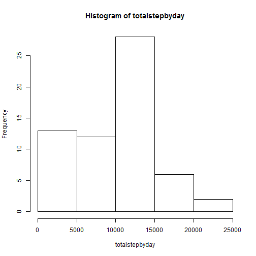
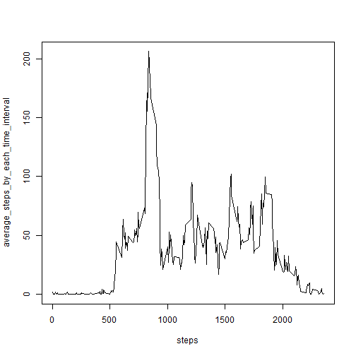
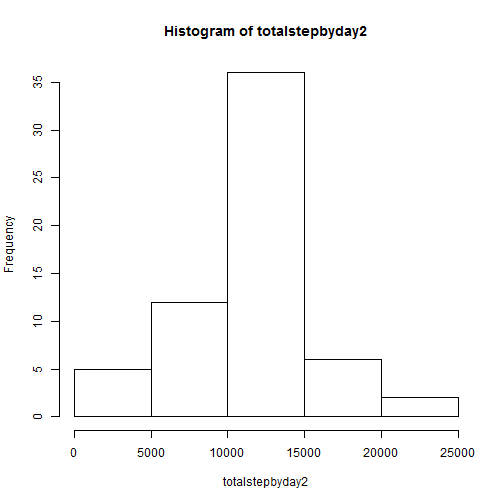
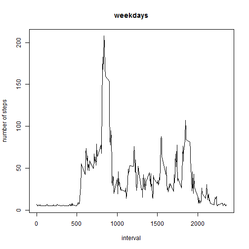
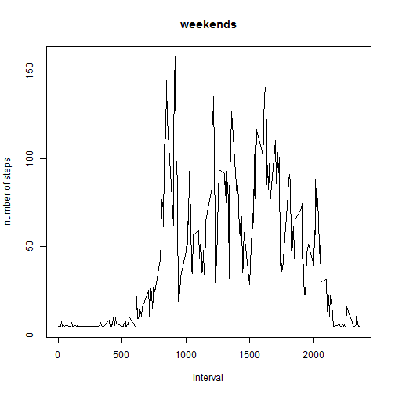

##This is markdown document for the peer assignment 1 of reproducible Research course of Coursera Data Science Specialisation.## 

###Initial steps in Project###
- show the code needed to process and load the data. 
- process the data in a format necessary for the analysis. 


```r
ls()
```

```
##  [1] "average_steps_by_each_time_interval"
##  [2] "average3"                           
##  [3] "average4"                           
##  [4] "data"                               
##  [5] "data2"                              
##  [6] "data3"                              
##  [7] "DT"                                 
##  [8] "fileurl"                            
##  [9] "intervalfactor"                     
## [10] "maxsteps"                           
## [11] "steps"                              
## [12] "totalmissingvalues"                 
## [13] "totalstepbyday"                     
## [14] "totalstepbyday2"                    
## [15] "weekdays"                           
## [16] "weekends"
```

```r
rm(list=ls())
setwd("F:/Rujuta/Coursera/ReproResearch")
setInternet2(use=TRUE)
fileurl <- "http://d396qusza40orc.cloudfront.net/repdata%2Fdata%2Factivity.zip"
download.file(fileurl, destfile="./Factivity.zip",mode="wb")
unzip("./Factivity.zip")
data <- read.csv("./activity.csv", header=TRUE)
head(data)
```

```
##   steps       date interval
## 1    NA 2012-10-01        0
## 2    NA 2012-10-01        5
## 3    NA 2012-10-01       10
## 4    NA 2012-10-01       15
## 5    NA 2012-10-01       20
## 6    NA 2012-10-01       25
```


### What is mean total number of steps taken per day?###
- For this part of the assignment, you can ignore the missing values in the dataset.

- Make a histogram of the total number of steps taken each day

- Calculate and report the mean and median total number of steps taken per day


```r
#Q1. what is mean total number of steps taken per day 
totalstepbyday <- by(data[ ,1],INDICES=data$date,sum,na.rm=TRUE)
#histogram of total steps by day 
hist(totalstepbyday)
```

 

```r
mean(totalstepbyday)
```

```
## [1] 9354.23
```

```r
median(totalstepbyday)
```

```
## 2012-10-20 
##      10395
```


###What is the average daily activity pattern?###
- Make a time series plot (i.e. type = "l") of the 5-minute interval (x-axis) and the average number of steps taken, averaged across all days (y-axis)

- Which 5-minute interval, on average across all the days in the dataset, contains the maximum number of steps?


```r
#What is average daily activity pattern?
#making a time series plot of 5 min and averaged across all days 
intervalfactor <- as.factor(data$interval)
data2 <- data
intervalfactor -> data2$interval
#average steps per time interval calculated average_steps_by_each_time_interval <- by(data[ ,1],intervalfactor,mean, na.rm=TRUE)
steps <- by(data[,3], intervalfactor,mean,na.rm=TRUE)
average_steps_by_each_time_interval <- by(data[ ,1],intervalfactor,mean, na.rm=TRUE)
plot(average_steps_by_each_time_interval~steps, type="l")
```

 

```r
maxsteps <- data2[max(average_steps_by_each_time_interval),]
print("the maximum number of steps taken in an average time interval are")
```

```
## [1] "the maximum number of steps taken in an average time interval are"
```

```r
maxsteps
```

```
##     steps       date interval
## 206    NA 2012-10-01     1705
```

```r
# rough data4 <- cbind(steps, average_steps_by_each_time_interval)
# rough which.max(data4[average_steps_by_each_time_interval])
```


###Imputing missing values###

- Note that there are a number of days/intervals where there are missing values (coded as NA). The presence of missing days may introduce bias into some calculations or summaries of the data.

- Calculate and report the total number of missing values in the dataset (i.e. the total number of rows with NAs)

- Devise a strategy for filling in all of the missing values in the dataset. The strategy does not need to be sophisticated. For example, you could use the mean/median for that day, or the mean for that 5-minute interval, etc.

- Create a new dataset that is equal to the original dataset but with the missing data filled in.

- Make a histogram of the total number of steps taken each day and Calculate and report the mean and median total number of steps taken per day. Do these values differ from the estimates from the first part of the assignment? What is the impact of imputing missing data on the estimates of the total daily number of steps?


```r
#first to calculate and report total number of missing values in the dataset (i.e. total number of rows with NAs. )
totalmissingvalues <- sum(is.na(data2$steps))
totalmissingvalues
```

```
## [1] 2304
```

```r
data3 <- data2
  data2[is.na(data2[ ,1]), 1] <- mean(data2[,1],na.rm=TRUE)  
head(data2)
```

```
##     steps       date interval
## 1 37.3826 2012-10-01        0
## 2 37.3826 2012-10-01        5
## 3 37.3826 2012-10-01       10
## 4 37.3826 2012-10-01       15
## 5 37.3826 2012-10-01       20
## 6 37.3826 2012-10-01       25
```

```r
totalstepbyday2 <- by(data2[ ,1],INDICES=data$date,sum,na.rm=TRUE)
#histogram of total steps by day 
hist(totalstepbyday2)
```

 

```r
mean(totalstepbyday2)
```

```
## [1] 10766.19
```

```r
median(totalstepbyday2)
```

```
## 2012-11-04 
##   10766.19
```


###Are there differences in activity patterns between weekdays and weekends?###

For this part the weekdays() function may be of some help here. Use the dataset with the filled-in missing values for this part.

Create a new factor variable in the dataset with two levels -- "weekday" and "weekend" indicating whether a given date is a weekday or weekend day.

Make a panel plot containing a time series plot (i.e. type = "l") of the 5-minute interval (x-axis) and the average number of steps taken, averaged across all weekday days or weekend days (y-axis). 


```r
#inserting a factor variable in the dataset with 2 levels - weekday and weekend, indicating whether a given date is a weekday or weekend day. 
library(data.table)
DT <- data.table(x=data2$steps, y=data2$date, z=data2$interval)

library("timeDate", lib.loc="~/R/win-library/3.1")
DT[ , weekdef := isWeekend(as.Date(y))]
```

```
##              x          y    z weekdef
##     1: 37.3826 2012-10-01    0   FALSE
##     2: 37.3826 2012-10-01    5   FALSE
##     3: 37.3826 2012-10-01   10   FALSE
##     4: 37.3826 2012-10-01   15   FALSE
##     5: 37.3826 2012-10-01   20   FALSE
##    ---                                
## 17564: 37.3826 2012-11-30 2335   FALSE
## 17565: 37.3826 2012-11-30 2340   FALSE
## 17566: 37.3826 2012-11-30 2345   FALSE
## 17567: 37.3826 2012-11-30 2350   FALSE
## 17568: 37.3826 2012-11-30 2355   FALSE
```

```r
weekdays <- subset(DT,subset=(weekdef==FALSE))
weekends <- subset(DT, subset=(weekdef==TRUE))
# weekdays  plotting

#What is average daily activity pattern?
#making a time series plot of 5 min and averaged across all days 
intervalfactor <- as.factor(weekdays$z)

intervalfactor -> weekdays$z
#average steps per time interval calculated average_steps_by_each_time_interval <- by(data[ ,1],intervalfactor,mean, na.rm=TRUE)

average3 <- by(weekdays$x,intervalfactor,mean, na.rm=TRUE)
#plot(average3~steps, type="l")

# weekend  plotting

#What is average daily activity pattern?
#making a time series plot of 5 min and averaged across all days 
intervalfactor <- as.factor(weekends$z)

intervalfactor -> weekends$z
#average steps per time interval calculated average_steps_by_each_time_interval <- by(data[ ,1],intervalfactor,mean, na.rm=TRUE)

average4 <- by(weekends$x,intervalfactor,mean, na.rm=TRUE)

#plots
plot(average3~steps, type="l",main="weekdays",xlab="interval",ylab="number of steps")
```

 

```r
plot(average4~steps, type="l",main="weekends",xlab="interval",ylab="number of steps")
```

 

```r
library("knitr", lib.loc="~/R/win-library/3.1")
library("markdown", lib.loc="~/R/win-library/3.1")
```

##Thanks for Reading !!##
